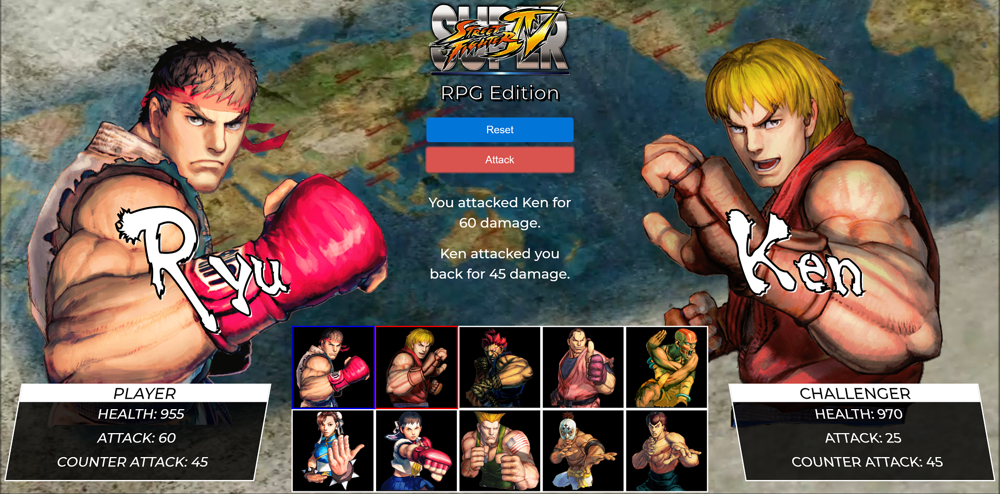

# RPG-Game

This RPG Game is inspired on Street Fighter's Arcade game

Link: https://saloiofun.github.io/RPG-game/

## Getting Started

* Choose a character by clicking on the fighter's picture. You will fight as that character for the rest of the game.
* Choose an opponent by clicking on an enemy's picture.
* Defeat all of the remaining fighters.
* Click on "Attack" button to attack your enemy.
    * Whenever the player clicks attack, their character damages the defender. The opponent will lose HP (health points). These points are displayed at the bottom of the defender's picture.
    * The opponent character will instantly counter the attack. When that happens, the player's character will lose some of their HP. These points are shown at the bottom of the player character's picture.
* Keep hitting the attack button in an effort to defeat their opponent.
* When the opponent's HP is reduced to zero or below, the picture will be grayed out. You can now choose a new opponent.
* You win the game by defeating all enemy characters. You lose the game the game if your character's HP falls to zero or below.

## Notes

* Each character in the game has 3 attributes: Health Points, Attack Power and Counter Attack Power.

* Each time the player attacks, their character's Attack Power increases by its base Attack Power.

  For example, if the base Attack Power is 6, each attack will increase the Attack Power by 6 (12, 18, 24, 30 and so on).

* The enemy character only has Counter Attack Power.

* Unlike the player's Attack Points, Counter Attack Power never changes.

* No characters in the game can heal or recover Health Points.

A winning player must pick their characters wisely by first fighting an enemy with low Counter Attack Power. This will allow them to grind Attack Power and to take on enemies before they lose all of their Health Points. Healing options would mess with this dynamic.
Your players should be able to win and lose the game no matter what character they choose. The challenge should come from picking the right enemies, not choosing the strongest player.

## Tools used

* HTML 5
* CSS
* JavaScript
* Jquery
* Bootstrap 4
